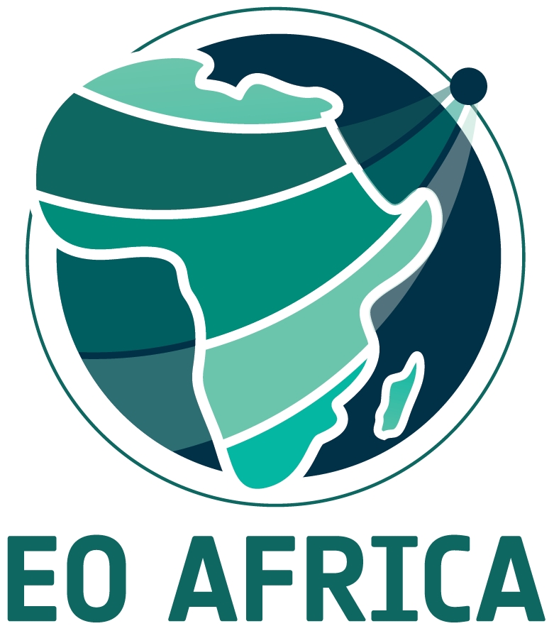

# Biomass estimations from satellite EO

Part of EOAfrica R&D Facility course material:

* Training Module 6 & Online Course 4: Vegetation and Drought Monitoring from Space

**Authors: Roel Van Hoolst**

Organisation: VITO Remote Sensing [(website)](https://remotesensing.vito.be/)

## Introduction
Exercises on monitoring biomass production using satellite remote sensing.

## Contents

* Exercise 1 (GPP_NPP_input_exploration.ipynb):
Here you will explore which inputs are required to compute biomass production from satellite input data and run your own NPP model.

* Exercise 2 (Wapor_NPP_TBP.ipynb):
Here you will learn how to access and explore the biomass data products of the FAO WaPOR data portal.